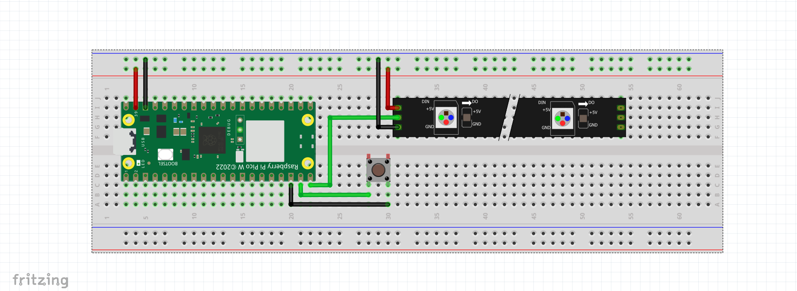

# Manual setup

There is no installer or build step — this is plain MicroPython. Setup is:
wire the hardware, flash the firmware once, then copy the project's files
onto the board.

## 1. Flash MicroPython

Download the official MicroPython firmware for the **Raspberry Pi Pico W**
(`.uf2` file) from micropython.org and flash it the usual way: hold the
**BOOTSEL** button while plugging the Pico W into USB, it will mount as a mass
storage drive, then drag the `.uf2` file onto it. The board reboots running
MicroPython.

## 2. Wire the hardware

The simplest working setup is just the Pico W and a WS2812B strip — the button
is optional. Here's that minimal example:



{: .note }
> In this diagram the strip's data line goes to **GP15** and the button to
> **GP14**. To use it as-is, set `leds.pin: 15` and `button.pin: 14` in
> `config.json`; otherwise wire to the defaults in the table below (`GP0` /
> `GP3`).

{: .note }
> A 3D-printable enclosure for this build is available on Thingiverse:
> [thingiverse.com/thing:6678379](https://www.thingiverse.com/thing:6678379).

### Pinout (defaults, configurable in `config.json`)

| Function             | Default Pico W pin | Config key    | Notes                                   |
|-----------------------|-----------|---------------|------------------------------------------|
| WS2812B data          | `GP0`     | `leds.pin`    | Required                                  |
| Push button (cover)   | `GP3`     | `button.pin`  | Optional, active-low, internal pull-up    |

### WS2812B LED strip

- The strip is **5V logic and 5V power** (`WS2812B`).
- The Pico W's GPIO runs at **3.3V**. WS2812B data lines are commonly driven
  directly from a 3.3V GPIO and work reliably for short runs, but it's outside
  the chip's guaranteed spec — for longer strips or if you see flicker/glitches
  at the far end, add a level shifter (e.g. 74AHCT125) between `GP0` and the
  strip's data-in.
- Connect the strip's **ground to the Pico W's ground** even if the strip has
  its own 5V supply — a floating/missing common ground is the most common
  cause of erratic pixels.
- **Power budget**: each WS2812B LED can draw up to ~60mA at full white. At
  the default `leds.count: 144` that's up to ~8.6A — do **not** power the
  strip from the Pico's USB or 3V3 pin. Use a dedicated 5V supply sized for
  your LED count, wired directly to the strip's 5V/GND, sharing ground with
  the Pico.
- Add a large capacitor (e.g. 1000µF) across the strip's 5V/GND near the first
  pixel, and a ~300-500Ω resistor in series on the data line, per the usual
  WS2812B best practices — both reduce power-on glitches and ringing on the
  data line.

### Push button (optional)

- A simple momentary push button wired between `GP3` and ground.
- Configured `Pin.PULL_UP` in software (`ButtonChannel`), so no external
  pull-up resistor is needed — the pin reads high when open, low when pressed.
- Debounced entirely in software by polling every 20ms and requiring two
  stable consecutive reads before registering an edge.
- Press semantics (see the [Button channel](channels/button.md)): a short
  press turns the device on when it's off, or cycles to the next mode when
  it's on; a ~1s hold toggles on/off; holding past ~2s aborts the action.

## 3. Copy the project onto the device

Copy these onto the device's filesystem, preserving the folder layout:

- `main.py`
- `src/` (the application code)
- `lib/` (`mqtt_as.py`)

Use whichever tool you're comfortable with — `mpremote`, `rshell`, or Thonny's
file browser all work:

```
mpremote cp -r src :src
mpremote cp -r lib :lib
mpremote cp main.py :main.py
```

Do **not** copy `tests/`, `helpers/`, or `docs/` — those are host-side only and
never run on the device, create `certs` directory if you want to sercure mqtt ssl.

## 4. Provide a config file

On first boot, if no `config.json` exists on the device (or it's corrupt),
`Storage` recreates one from the built-in defaults in `src/defaults.py` — the
device boots with Wi-Fi and MQTT disabled until configured.

To configure it upfront instead, create `config.json` with the same shape as
`DEFAULTS` in `src/defaults.py` and fill in at least:

- `wifi.ssid` / `wifi.password`
- `mqtt.server` / `mqtt.port` / `mqtt.user` / `mqtt.password` / `mqtt.base_topic`
  (leave `mqtt.server` empty to disable MQTT entirely)
- `leds.count` / `leds.pin` to match your strip
- `button.pin` if wired to a non-default GPIO
- `watchdog.enabled: true` for a deployed device — arms the hardware watchdog
  so the board auto-reboots if the firmware ever hangs (leave it `false` while
  developing; see the [Development guide](development.md#watchdog))

Copy that `config.json` onto the device alongside `main.py`/`src`/`lib`.

Don't have Wi-Fi credentials to hand yet, or want to configure the device
from your phone instead of hand-editing JSON? Skip this step — on first boot
with no `wifi.ssid` set, the device opens its own temporary Wi-Fi network so
you can configure everything from a browser. See
[Can't connect? The device opens its own setup network](channels/wifi.md#cant-connect-the-device-opens-its-own-setup-network).

`wifi.*` and `mqtt.*` are applied at runtime (the channels reconnect on the
spot when the config changes), but the pin assignments (`leds.pin`,
`button.pin`), `watchdog.enabled`, and `leds.on_after_boot` are
only read at boot — changing those means editing the config and rebooting.
See the per-key **Applies** column in the
[Development guide](development.md#top-level-keys).

All runtime state lives in the same file: mode, brightness, speed, and on/off
state are merged into it and autosaved (debounced, atomic write) whenever
they change, so the device resumes where it left off after a power cycle. See
the [Development guide](development.md) for the full list of config keys, how
saving works under the hood, and `config.dev.json` (a git-ignored variant for
local development, so real credentials never end up in the repo).

## 5. First boot

Power the board. Startup order is: load config → start renderer + autosave
task → start all channels concurrently (Wi-Fi, button, MQTT, Web API).
Nothing blocks on Wi-Fi/MQTT connecting — the LED strip lights up immediately
using the persisted mode.

If `logging.enabled` is `true` in the config, log lines are written to the
console appender — watch them over the USB serial REPL.

## 6. Talking to the device

MQTT waits until Wi-Fi is connected before doing anything — check
`runtime.wifi.connected` if a message doesn't seem to land. The Web UI works
as soon as the device has *any* network up, including its own setup network.
For topics, payloads, and the dashboard, see:

- [MQTT](channels/mqtt.md) — topics, retained state, last will
- [Web API](channels/webapi.md) — the browser dashboard and configuration
  page

## Developing or extending it

See the [Development guide](development.md) for the architecture, how to set
up a host-side dev environment (lint/test/compile-check), and how to add a
new control method or lighting mode.
